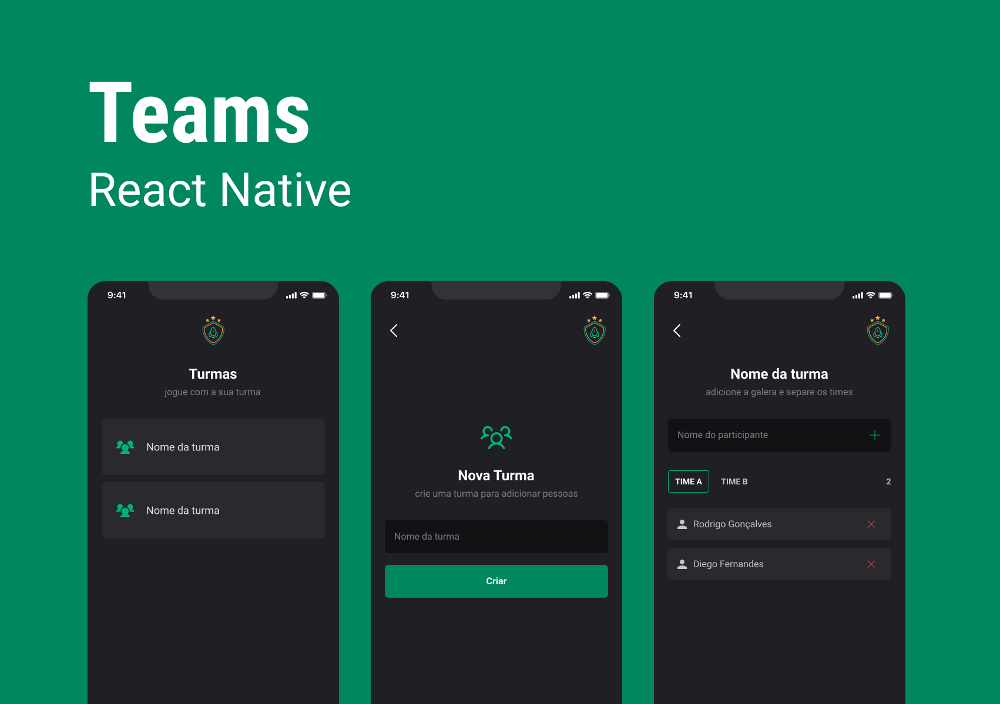

# Teams



O projeto Teams tem a proposta de ajudar a organizar pessoas que se reúnem para jogar em turmas. É um aplicativo com navegação em pilhas onde é possível cadastrar/remover turmas/membros do time e armazenar essas informações no armazenamento local do aparelho, preservando os dados mesmo que o app seja fechado. É seguido um guia de estilo para implementar nosso tema no Styled Components a fim de manter um padrão em todo o app.

## Recursos do Projeto

- Cadastro de turmas: Os usuários podem criar turmas e fornecer informações como nome, descrição e outras informações relevantes.
- Remoção de turmas: Os usuários podem remover turmas existentes se não forem mais necessárias.
- Adição de membros do time: Os usuários podem adicionar membros aos times existentes, fornecendo detalhes como nome, idade, posição, etc.
- Armazenamento local: Os dados das turmas e membros do time são armazenados localmente no aparelho do usuário, garantindo a preservação dos dados mesmo quando o aplicativo é fechado.

## Design do Projeto

O design do projeto foi criado no Figma. Você pode conferir o design completo [aqui](https://www.figma.com/file/7ccBZRLLl7ga90OPeCnqzx/Teams?type=design&node-id=524%3A330&t=Y7Ec3xJIaJklBLDQ-1). Ele inclui a interface visual e os fluxos de navegação do aplicativo.

## Apresentação do Projeto

Também temos uma apresentação interativa do projeto no Figma. Você pode visualizá-la [aqui](https://www.figma.com/proto/7ccBZRLLl7ga90OPeCnqzx/Teams?type=design&node-id=524-330&scaling=min-zoom&page-id=37%3A6). Ela fornece uma visão mais detalhada das telas e interações do aplicativo.

## Como Clonar o Repositório

Para clonar o repositório em sua máquina local, siga as etapas abaixo:

1. Abra o terminal e navegue até o diretório em que deseja clonar o repositório.

2. Execute o seguinte comando para clonar o repositório:

   ```shell
   git clone https://github.com/PauloEwerson/teams.git

3. Após o término do processo, você terá uma cópia local do repositório em seu computador.

## Configuração do Projeto

O projeto foi desenvolvido em React Native. Para configurar o ambiente de desenvolvimento e executar o projeto, siga as etapas abaixo:

1. Certifique-se de ter o Node.js instalado em seu sistema. Você pode fazer o download e instalá-lo a partir do site oficial do Node.js: https://nodejs.org

2. Navegue até o diretório do projeto clonado em seu terminal.

3. Instale as dependências do projeto executando o seguinte comando:

   ```shell
   npm install

4. Após a instalação das dependências, você pode executar o projeto usando o seguinte comando:

   ```shell
   npm start

Esse comando iniciará o servidor de desenvolvimento e exibirá um código QR no terminal.

5. Baixe o aplicativo Expo Go em seu dispositivo móvel através da loja de aplicativos (App Store ou Google Play).

6. Escaneie o código QR exibido no terminal com o aplicativo Expo Go para abrir o aplicativo no seu dispositivo.

Certifique-se de que o dispositivo móvel esteja conectado à mesma rede Wi-Fi que o computador em que o servidor de desenvolvimento está sendo executado.

7. O aplicativo será aberto no dispositivo móvel e estará pronto para ser testado.

## Guia de Estilo
Para manter um padrão de estilo consistente em todo o aplicativo, utilizaremos o Styled Components. O Styled Components é uma biblioteca popular do ecossistema React que permite escrever estilos CSS diretamente nos componentes. Isso ajuda a manter os estilos encapsulados e reutilizáveis.

Para implementar o guia de estilo, siga as diretrizes abaixo:

1. Instale o pacote styled-components em seu projeto:

   ```shell
   npm install styled-components

2. Importe o pacote no componente em que você deseja aplicar estilos:
`
```
   import styled from 'styled-components';
   ```

3. Crie componentes estilizados usando a sintaxe do Styled Components. Por exemplo:

```
const Button = styled.button`
  background-color: #ff0000;
  color: #ffffff;
  font-size: 16px;
  padding: 10px 20px;
  border-radius: 5px;
`;
```

- O exemplo acima cria um componente de botão estilizado com um fundo vermelho, texto branco, fonte de 16 pixels, preenchimento de 10 pixels acima e abaixo e 20 pixels à esquerda e à direita, e bordas arredondadas. Você pode usar esses componentes estilizados em seu aplicativo para manter uma aparência coerente em todos os lugares.
